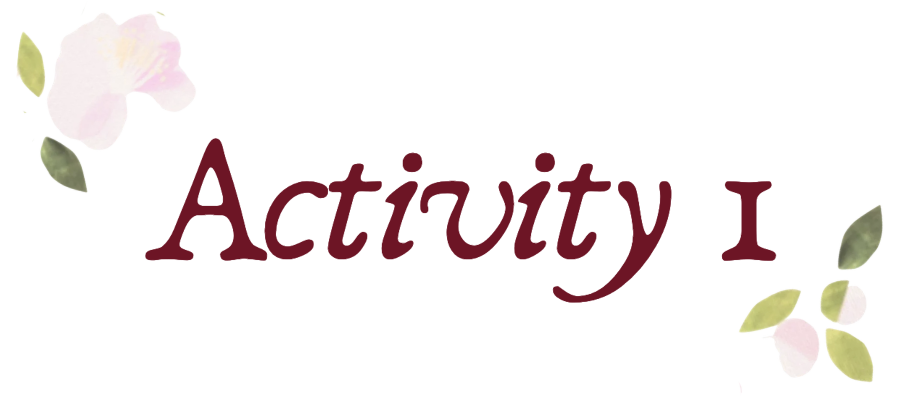
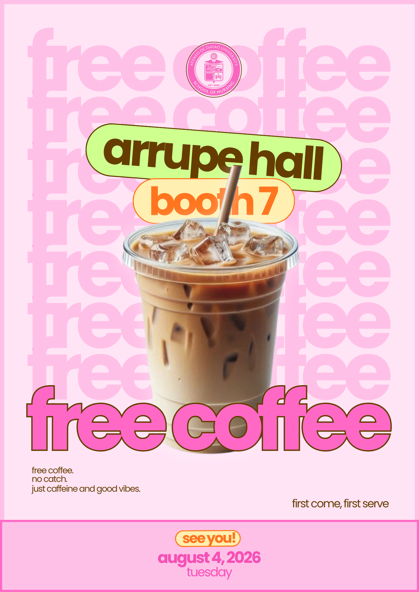

 

<i> 
⟡⋆˙ ᴘʀᴇꜱᴇɴᴛᴀᴛɪᴏɴ ᴅᴇꜱɪɢɴ ᴘʀɪɴᴄɪᴘʟᴇꜱ ⋆˙⟡
</i>

 

This activity focused on applying fundamental presentation design principles to create a visually engaging promotional poster. The objective was to explore how design elements such as typography, color, layout, and visual hierarchy can be combined to effectively communicate a message.

For this activity, I created a promotional poster for a free coffee booth event. The design aimed to capture a fun, youthful, and inviting atmosphere while highlighting important details such as the event name, booth location, and the time and date.

<table>
<tr>
<td width="30%" align="center">

</td>

<td width="70%">

 

The visual direction was inspired by a playful café aesthetic that reflects warmth, creativity, and positive energy. A pastel pink color palette was used as the dominant theme to create a friendly and approachable feel, while the contrasting green and orange elements helped emphasize important information.

The design utilized bold and oversized typography, especially in the <b>"free coffee"</b> text, to immediately capture attention and establish a strong focal point. The layered text elements, coffee image, and decorative background patterns were arranged to create a dynamic composition while maintaining readability.

</td>
</tr>
</table>

  

The poster uses different font sizes and placements to guide the viewer's attention. The large <b>"free coffee"</b> text serves as the primary focal point, while supporting details such as the booth number, event date, and tagline are positioned strategically to provide additional information.

 
 

Contrast was applied through the combination of bright colors, bold typography, and varying text sizes. The use of pink, orange, green, and brown elements creates separation between different design components and improves visibility.

 

The composition balances the large coffee image with the surrounding typography and background elements. The centered placement of the drink creates stability, while the surrounding text and decorative elements add visual interest.

 

A consistent visual identity was maintained through the repeated use of the pastel color palette, playful typography, and café-inspired design elements. This creates a cohesive and recognizable poster design.

 

---

 

<i>

𝚃𝚑𝚛𝚘𝚞𝚐𝚑 𝚝𝚑𝚒𝚜 𝚊𝚌𝚝𝚒𝚟𝚒𝚝𝚢, 𝙸 𝚕𝚎𝚊𝚛𝚗𝚎𝚍 𝚝𝚑𝚊𝚝 𝚎𝚏𝚏𝚎𝚌𝚝𝚒𝚟𝚎 𝚍𝚎𝚜𝚒𝚐𝚗 𝚒𝚜 𝚗𝚘𝚝 𝚘𝚗𝚕𝚢 𝚊𝚋𝚘𝚞𝚝 𝚖𝚊𝚔𝚒𝚗𝚐 𝚊𝚗 𝚘𝚞𝚝𝚙𝚞𝚝 𝚟𝚒𝚜𝚞𝚊𝚕𝚕𝚢 𝚊𝚙𝚙𝚎𝚊𝚕𝚒𝚗𝚐 𝚋𝚞𝚝 𝚊𝚕𝚜𝚘 𝚊𝚋𝚘𝚞𝚝 𝚌𝚘𝚖𝚖𝚞𝚗𝚒𝚌𝚊𝚝𝚒𝚗𝚐 𝚒𝚗𝚏𝚘𝚛𝚖𝚊𝚝𝚒𝚘𝚗 𝚌𝚕𝚎𝚊𝚛𝚕𝚢. 𝙴𝚊𝚌𝚑 𝚎𝚕𝚎𝚖𝚎𝚗𝚝, 𝚏𝚛𝚘𝚖 𝚌𝚘𝚕𝚘𝚛𝚜 𝚝𝚘 𝚝𝚢𝚙𝚘𝚐𝚛𝚊𝚙𝚑𝚢, 𝚌𝚘𝚗𝚝𝚛𝚒𝚋𝚞𝚝𝚎𝚜 𝚝𝚘 𝚑𝚘𝚠 𝚝𝚑𝚎 𝚊𝚞𝚍𝚒𝚎𝚗𝚌𝚎 𝚞𝚗𝚍𝚎𝚛𝚜𝚝𝚊𝚗𝚍𝚜 𝚊𝚗𝚍 𝚒𝚗𝚝𝚎𝚛𝚊𝚌𝚝𝚜 𝚠𝚒𝚝𝚑 𝚝𝚑𝚎 𝚍𝚎𝚜𝚒𝚐𝚗.

𝚃𝚑𝚒𝚜 𝚊𝚌𝚝𝚒𝚟𝚒𝚝𝚢 𝚜𝚝𝚛𝚎𝚗𝚐𝚝𝚑𝚎𝚗𝚎𝚍 𝚖𝚢 𝚊𝚙𝚙𝚛𝚎𝚌𝚒𝚊𝚝𝚒𝚘𝚗 𝚏𝚘𝚛 𝚒𝚗𝚝𝚎𝚗𝚝𝚒𝚘𝚗𝚊𝚕 𝚍𝚎𝚜𝚒𝚐𝚗 𝚌𝚑𝚘𝚒𝚌𝚎𝚜 𝚊𝚗𝚍 𝚑𝚘𝚠 𝚟𝚒𝚜𝚞𝚊𝚕 𝚌𝚘𝚖𝚖𝚞𝚗𝚒𝚌𝚊𝚝𝚒𝚘𝚗 𝚌𝚊𝚗 𝚝𝚛𝚊𝚗𝚜𝚏𝚘𝚛𝚖 𝚜𝚒𝚖𝚙𝚕𝚎 𝚌𝚘𝚗𝚌𝚎𝚙𝚝𝚜 𝚒𝚗𝚝𝚘 𝚎𝚗𝚐𝚊𝚐𝚒𝚗𝚐 𝚎𝚡𝚙𝚎𝚛𝚒𝚎𝚗𝚌𝚎𝚜.

</i>

 

---

<b>⟡⋆˙ ᴀᴄᴛɪᴠᴛɪʏ 1 ⋆˙⟡ </b>

ᴘʀᴇꜱᴇɴᴛᴀᴛɪᴏɴ ᴅᴇꜱɪɢɴ ᴘʀɪɴᴄɪᴘʟᴇꜱ

 
<a href="Activity-1/Activity-1-Output.png">
See image →
</a>

 
 

