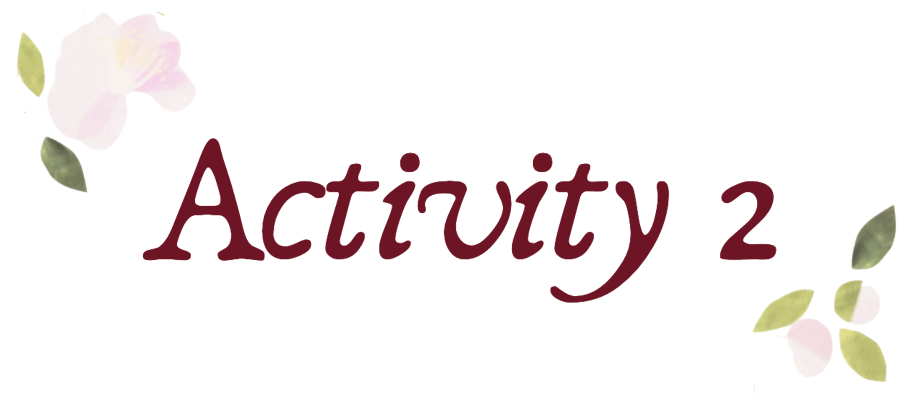

 

<i> 
⟡⋆˙ ᴘᴇʀꜱᴏɴᴀʟ ʙʀᴀɴᴅɪɴɢ ⋆˙⟡
</i>

 
 

This activity focuses on creating a personal brand identity by combining visual elements that represent my personality, values, and creative direction. Through this process, I developed a cohesive branding system consisting of a logo, tagline, color palette, typography, and visual applications.

The goal of this activity was to understand how thoughtful design choices can communicate identity and create a consistent visual presence across different platforms and materials.

 

The visual direction of my personal brand is inspired by elegance, creativity, and personal growth. The design incorporates soft floral elements, warm neutral tones, and refined typography to create a balance between a professional and artistic identity.

The overall aesthetic follows a minimal yet expressive approach, using delicate details and a harmonious color palette to reflect a sense of confidence, individuality, and continuous development.

</td>
</tr>
</table>

  

The arrangement of elements guides attention toward important components such as the logo, brand name, and supporting information.

 

The selected colors work together to establish a warm and sophisticated atmosphere. Burgundy represents confidence and passion, while softer tones add creativity and approachability.

The combination of elegant script fonts with clean typography creates visual balance between creativity and professionalism.

Each design element was carefully selected to represent my personality, interests, and vision as a future healthcare professional who values creativity and innovation.

The use of a unified color palette, typography system, and recurring visual elements creates a recognizable and cohesive brand identity.

 

---

 

<i>

𝚃𝚑𝚛𝚘𝚞𝚐𝚑 𝚝𝚑𝚒𝚜 𝚊𝚌𝚝𝚒𝚟𝚒𝚝𝚢, 𝙸 𝚕𝚎𝚊𝚛𝚗𝚎𝚍 𝚝𝚑𝚊𝚝 𝚙𝚎𝚛𝚜𝚘𝚗𝚊𝚕 𝚋𝚛𝚊𝚗𝚍𝚒𝚗𝚐 𝚒𝚜 𝚖𝚘𝚛𝚎 𝚝𝚑𝚊𝚗 𝚓𝚞𝚜𝚝 𝚌𝚛𝚎𝚊𝚝𝚒𝚗𝚐 𝚊 𝚟𝚒𝚜𝚞𝚊𝚕𝚕𝚢 𝚊𝚙𝚙𝚎𝚊𝚕𝚒𝚗𝚐 𝚍𝚎𝚜𝚒𝚐𝚗. 𝙸𝚝 𝚒𝚜 𝚊𝚋𝚘𝚞𝚝 𝚌𝚘𝚗𝚟𝚎𝚢𝚒𝚗𝚐 𝚒𝚍𝚎𝚗𝚝𝚒𝚝𝚢, 𝚟𝚊𝚕𝚞𝚎𝚜, 𝚊𝚗𝚍 𝚙𝚎𝚛𝚜𝚘𝚗𝚊𝚕𝚒𝚝𝚢 𝚝𝚑𝚛𝚘𝚞𝚐𝚑 𝚌𝚊𝚛𝚎𝚏𝚞𝚕𝚕𝚢 𝚌𝚑𝚘𝚜𝚎𝚗 𝚍𝚎𝚜𝚒𝚐𝚗 𝚎𝚕𝚎𝚖𝚎𝚗𝚝𝚜. 𝙸 𝚍𝚒𝚜𝚌𝚘𝚟𝚎𝚛𝚎𝚍 𝚝𝚑𝚊𝚝 𝚌𝚘𝚕𝚘𝚛𝚜, 𝚝𝚢𝚙𝚘𝚐𝚛𝚊𝚙𝚑𝚢, 𝚊𝚗𝚍 𝚟𝚒𝚜𝚞𝚊𝚕 𝚜𝚝𝚢𝚕𝚎 𝚊𝚛𝚎 𝚙𝚘𝚠𝚎𝚛𝚏𝚞𝚕 𝚝𝚘𝚘𝚕𝚜 𝚝𝚑𝚊𝚝 𝚑𝚎𝚕𝚙 𝚝𝚎𝚕𝚕 𝚊 𝚜𝚝𝚘𝚛𝚢 𝚊𝚗𝚍 𝚌𝚛𝚎𝚊𝚝𝚎 𝚊 𝚖𝚎𝚊𝚗𝚒𝚗𝚐𝚏𝚞𝚕 𝚌𝚘𝚗𝚗𝚎𝚌𝚝𝚒𝚘𝚗 𝚠𝚒𝚝𝚑 𝚘𝚝𝚑𝚎𝚛𝚜.

𝚃𝚑𝚒𝚜 𝚊𝚌𝚝𝚒𝚟𝚒𝚝𝚢 𝚊𝚕𝚜𝚘 𝚑𝚎𝚕𝚙𝚎𝚍 𝚖𝚎 𝚛𝚎𝚊𝚕𝚒𝚣𝚎 𝚝𝚑𝚎 𝚒𝚖𝚙𝚘𝚛𝚝𝚊𝚗𝚌𝚎 𝚘𝚏 𝚌𝚘𝚗𝚜𝚒𝚜𝚝𝚎𝚗𝚌𝚢 𝚒𝚗 𝚍𝚎𝚜𝚒𝚐𝚗𝚒𝚗𝚐 𝚊 𝚙𝚎𝚛𝚜𝚘𝚗𝚊𝚕 𝚋𝚛𝚊𝚗𝚍. 𝙴𝚟𝚎𝚛𝚢 𝚍𝚎𝚝𝚊𝚒𝚕, 𝚏𝚛𝚘𝚖 𝚝𝚑𝚎 𝚕𝚘𝚐𝚘 𝚍𝚎𝚜𝚒𝚐𝚗 𝚝𝚘 𝚝𝚑𝚎 𝚌𝚘𝚕𝚘𝚛 𝚙𝚊𝚕𝚎𝚝𝚝𝚎 𝚊𝚗𝚍 𝚝𝚢𝚙𝚘𝚐𝚛𝚊𝚙𝚑𝚢, 𝚙𝚕𝚊𝚢𝚜 𝚊 𝚛𝚘𝚕𝚎 𝚒𝚗 𝚛𝚎𝚙𝚛𝚎𝚜𝚎𝚗𝚝𝚒𝚗𝚐 𝚖𝚢 𝚌𝚛𝚎𝚊𝚝𝚒𝚟𝚎 𝚒𝚍𝚎𝚗𝚝𝚒𝚝𝚢. 𝙸 𝚊𝚕𝚜𝚘 𝚕𝚎𝚊𝚛𝚗𝚎𝚍 𝚝𝚑𝚊𝚝 𝚐𝚘𝚘𝚍 𝚍𝚎𝚜𝚒𝚐𝚗 𝚒𝚜 𝚊 𝚋𝚊𝚕𝚊𝚗𝚌𝚎 𝚋𝚎𝚝𝚠𝚎𝚎𝚗 𝚌𝚛𝚎𝚊𝚝𝚒𝚟𝚒𝚝𝚢 𝚊𝚗𝚍 𝚌𝚕𝚊𝚛𝚒𝚝𝚢.

𝚄𝚕𝚝𝚒𝚖𝚊𝚝𝚎𝚕𝚢, 𝚝𝚑𝚒𝚜 𝚎𝚡𝚙𝚎𝚛𝚒𝚎𝚗𝚌𝚎 𝚜𝚑𝚘𝚠𝚎𝚍 𝚖𝚎 𝚑𝚘𝚠 𝚝𝚎𝚌𝚑𝚗𝚘𝚕𝚘𝚐𝚢 𝚌𝚊𝚗 𝚋𝚎 𝚞𝚜𝚎𝚍 𝚊𝚜 𝚊 𝚖𝚎𝚍𝚒𝚞𝚖 𝚏𝚘𝚛 𝚜𝚎𝚕𝚏-𝚎𝚡𝚙𝚛𝚎𝚜𝚜𝚒𝚘𝚗, 𝚌𝚘𝚖𝚖𝚞𝚗𝚒𝚌𝚊𝚝𝚒𝚘𝚗, 𝚊𝚗𝚍 𝚙𝚎𝚛𝚜𝚘𝚗𝚊𝚕 𝚐𝚛𝚘𝚠𝚝𝚑. 𝙰𝚜 𝚊 𝚏𝚞𝚝𝚞𝚛𝚎 𝚑𝚎𝚊𝚕𝚝𝚑𝚌𝚊𝚛𝚎 𝚙𝚛𝚘𝚏𝚎𝚜𝚜𝚒𝚘𝚗𝚊𝚕, 𝙸 𝚛𝚎𝚌𝚘𝚐𝚗𝚒𝚣𝚎 𝚝𝚑𝚊𝚝 𝚌𝚛𝚎𝚊𝚝𝚒𝚟𝚒𝚝𝚢 𝚊𝚗𝚍 𝚍𝚒𝚐𝚒𝚝𝚊𝚕 𝚕𝚒𝚝𝚎𝚛𝚊𝚌𝚢 𝚌𝚊𝚗 𝚎𝚗𝚑𝚊𝚗𝚌𝚎 𝚑𝚘𝚠 𝙸 𝚌𝚘𝚗𝚗𝚎𝚌𝚝, 𝚌𝚘𝚖𝚖𝚞𝚗𝚒𝚌𝚊𝚝𝚎, 𝚊𝚗𝚍 𝚒𝚗𝚗𝚘𝚟𝚊𝚝𝚎 𝚒𝚗 𝚖𝚢 𝚏𝚞𝚝𝚞𝚛𝚎 𝚙𝚛𝚊𝚌𝚝𝚒𝚌𝚎.

</i>

 

---

<b>⟡⋆˙ ᴀᴄᴛɪᴠᴛɪʏ 2 ⋆˙⟡ </b>

ᴘᴇʀꜱᴏɴᴀʟ ʙʀᴀɴᴅɪɴɢ

 
<a href="Activity 2 Output">
Explore →
</a>

 
 

