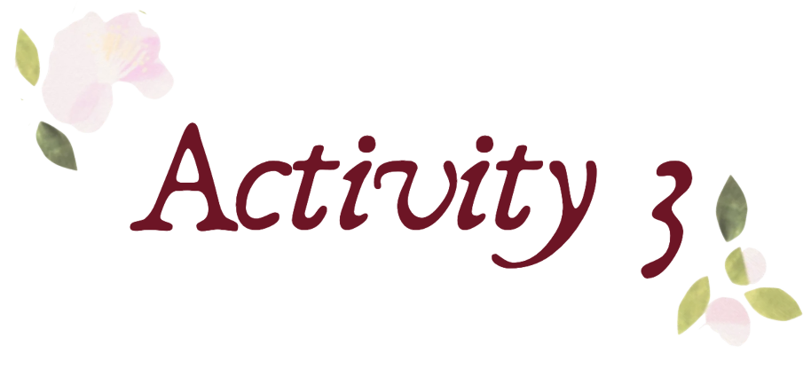

 

<b> ⟡⋆˙ ꜱᴏᴄɪᴀʟ ᴍᴇᴅɪᴀ ɪɴꜰᴏɢʀᴀᴘʜɪᴄꜱ ⋆˙⟡ </b>

<i> 
ᴛʜɪɴᴋ ʙᴇꜰᴏʀᴇ ʏᴏᴜ ꜱʜᴀʀᴇ: ᴄᴏᴍʙᴀᴛɪɴɢ ᴠᴀᴄᴄɪɴᴇ ᴍɪꜱɪɴꜰᴏʀᴍᴀᴛɪᴏɴ ᴏɴ ꜱᴏᴄɪᴀʟ ᴍᴇᴅɪᴀ
</i>

  

This infographic focuses on the growing issue of vaccine misinformation on social media and how false or misleading health information can influence public understanding and decision-making. It highlights how social media allows information to spread quickly, but it can also contribute to confusion, fear, vaccine hesitancy, and reduced trust in healthcare institutions.

The infographic presents the concept of an “infodemic,” referring to the excessive spread of information, including inaccurate or misleading content. It explains the effects of misinformation, such as decreased vaccine confidence, loss of public trust, and increased vulnerability to vaccine-preventable diseases.

 

<i>

To address this issue, the infographic introduces three technology-based solutions:

</i>

 

<b>Vaccine Misinformation Reporting System</b> – a platform where users can report suspicious vaccine-related content for verification.

<b>“Verify Before You Share” Browser Tool</b> – a digital reminder that encourages users to check the credibility of information before sharing.

<b>QR-Based Vaccine Fact Check</b> – a quick-access system that connects users to verified vaccine information through QR codes.

<table>
<tr>
<td width="30%" align="center">

</td>

<td width="50%">

 

The infographic follows a health education and awareness campaign style designed to make a complex public-health issue easier to understand.

The visual approach combines:

<b>“Friendly and approachable design elements</b> – The use of illustrations, rounded text boxes, icons, and social media symbols creates a less intimidating presentation of a serious health concern.

<b>Color psychology</b> – The infographic uses soft background tones with contrasting accent colors to maintain readability while emphasizing important information. Green elements represent health, trust, and solutions, while orange and red accents highlight risks, concerns, and urgent issues.

<b>Digital and healthcare elements</b> – The inclusion of vaccine-related illustrations, social media icons, and technology-based solution concepts reinforces the connection between healthcare communication and digital platforms.

</td>
</tr>
</table>

  

The infographic uses different font sizes, bold headings, colored labels, and section divisions to guide the viewer’s attention. Important concepts such as “Increased Vaccine Hesitancy,” “Loss of Public Trust,” and “Vaccine Misinformation Reporting System” are emphasized to make key information easily noticeable.

 
 

Information in a step-by-step flow: <b> Problem → Impact → Philippine Context → Solution → Sources </b>

This structure helps the audience understand the issue before introducing possible technological interventions.

Although the infographic contains research-based information, illustrations, icons, and visual separators prevent the design from becoming purely text-heavy. The visuals support understanding rather than simply decorating the page.

 

The infographic maintains consistent typography, colors, shapes, and spacing throughout the design. Repeated section headers and similar information boxes create a unified appearance and make the content easier to follow.

 

The design uses readable fonts, clear spacing, and highlighted keywords to ensure that important health information can be quickly understood by different audiences. This supports the goal of making reliable vaccine information more accessible.

 

---

 

<i>

𝚃𝚑𝚛𝚘𝚞𝚐𝚑 𝚝𝚑𝚒𝚜 𝚊𝚌𝚝𝚒𝚟𝚒𝚝𝚢, 𝙸 𝚕𝚎𝚊𝚛𝚗𝚎𝚍 𝚝𝚑𝚊𝚝 𝚌𝚛𝚎𝚊𝚝𝚒𝚗𝚐 𝚊𝚗 𝚎𝚏𝚏𝚎𝚌𝚝𝚒𝚟𝚎 𝚒𝚗𝚏𝚘𝚐𝚛𝚊𝚙𝚑𝚒𝚌 𝚒𝚜 𝚗𝚘𝚝 𝚘𝚗𝚕𝚢 𝚊𝚋𝚘𝚞𝚝 𝚙𝚛𝚎𝚜𝚎𝚗𝚝𝚒𝚗𝚐 𝚒𝚗𝚏𝚘𝚛𝚖𝚊𝚝𝚒𝚘𝚗 𝚋𝚞𝚝 𝚊𝚕𝚜𝚘 𝚊𝚋𝚘𝚞𝚝 𝚖𝚊𝚔𝚒𝚗𝚐 𝚌𝚘𝚖𝚙𝚕𝚎𝚡 𝚒𝚍𝚎𝚊𝚜 𝚎𝚊𝚜𝚢 𝚝𝚘 𝚞𝚗𝚍𝚎𝚛𝚜𝚝𝚊𝚗𝚍. 𝚃𝚑𝚒𝚜 𝚙𝚛𝚘𝚓𝚎𝚌𝚝 𝚑𝚎𝚕𝚙𝚎𝚍 𝚖𝚎 𝚛𝚎𝚌𝚘𝚐𝚗𝚒𝚣𝚎 𝚝𝚑𝚊𝚝 𝚟𝚒𝚜𝚞𝚊𝚕 𝚌𝚘𝚖𝚖𝚞𝚗𝚒𝚌𝚊𝚝𝚒𝚘𝚗 𝚙𝚕𝚊𝚢𝚜 𝚊𝚗 𝚒𝚖𝚙𝚘𝚛𝚝𝚊𝚗𝚝 𝚛𝚘𝚕𝚎 𝚒𝚗 𝚑𝚎𝚊𝚕𝚝𝚑 𝚎𝚍𝚞𝚌𝚊𝚝𝚒𝚘𝚗.

𝙱𝚢 𝚌𝚘𝚖𝚋𝚒𝚗𝚒𝚗𝚐 𝚛𝚎𝚜𝚎𝚊𝚛𝚌𝚑-𝚋𝚊𝚜𝚎𝚍 𝚌𝚘𝚗𝚝𝚎𝚗𝚝 𝚠𝚒𝚝𝚑 𝚌𝚕𝚎𝚊𝚛 𝚍𝚎𝚜𝚒𝚐𝚗 𝚎𝚕𝚎𝚖𝚎𝚗𝚝𝚜, 𝙸 𝚕𝚎𝚊𝚛𝚗𝚎𝚍 𝚑𝚘𝚠 𝚕𝚊𝚢𝚘𝚞𝚝, 𝚌𝚘𝚕𝚘𝚛𝚜, 𝚊𝚗𝚍 𝚟𝚒𝚜𝚞𝚊𝚕 𝚜𝚢𝚖𝚋𝚘𝚕𝚜 𝚌𝚊𝚗 𝚑𝚎𝚕𝚙 𝚊𝚞𝚍𝚒𝚎𝚗𝚌𝚎𝚜 𝚊𝚋𝚜𝚘𝚛𝚋 𝚒𝚖𝚙𝚘𝚛𝚝𝚊𝚗𝚝 𝚑𝚎𝚊𝚕𝚝𝚑 𝚖𝚎𝚜𝚜𝚊𝚐𝚎𝚜. 𝚃𝚑𝚒𝚜 𝚊𝚌𝚝𝚒𝚟𝚒𝚝𝚢 𝚊𝚕𝚜𝚘 𝚜𝚑𝚘𝚠𝚎𝚍 𝚖𝚎 𝚑𝚘𝚠 𝚝𝚎𝚌𝚑𝚗𝚘𝚕𝚘𝚐𝚢 𝚌𝚊𝚗 𝚋𝚎 𝚞𝚜𝚎𝚍 𝚊𝚜 𝚊 𝚝𝚘𝚘𝚕 𝚏𝚘𝚛 𝚙𝚞𝚋𝚕𝚒𝚌 𝚑𝚎𝚊𝚕𝚝𝚑 𝚊𝚠𝚊𝚛𝚎𝚗𝚎𝚜𝚜 𝚊𝚗𝚍 𝚛𝚎𝚜𝚙𝚘𝚗𝚜𝚒𝚋𝚕𝚎 𝚍𝚒𝚐𝚒𝚝𝚊𝚕 𝚌𝚘𝚖𝚖𝚞𝚗𝚒𝚌𝚊𝚝𝚒𝚘𝚗.
</i>

 

---

<b>⟡⋆˙ ᴀᴄᴛɪᴠᴛɪʏ 3 ⋆˙⟡ </b>

ꜱᴏᴄɪᴀʟ ᴍᴇᴅɪᴀ ɪɴꜰᴏɢʀᴀᴘʜɪᴄꜱ

 
<a href="Activity 3 Output">
See image and documentation →
</a>

 
 

