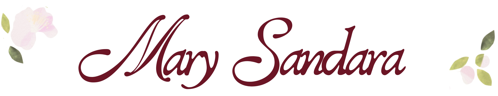

  
#### ᴡᴇʟᴄᴏᴍᴇ ᴛᴏ ᴍʏ ʟɪᴛᴛʟᴇ ᴄᴏʀɴᴇʀ ᴏꜰ ᴄʀᴇᴀᴛɪᴠɪᴛʏ, ɪ ᴀᴍ

 

*ʙʟᴏᴏᴍɪɴɢ ᴛʜʀᴏᴜɢʜ ʟᴇᴀʀɴɪɴɢ, ᴄʀᴇᴀᴛɪɴɢ ᴡɪᴛʜ ᴘᴜʀᴘᴏꜱᴇ*

 

  

<table>
  
<tr>

<td width="30%" align="center">

</td>

<td width="65%">

  
<b> ʜᴇʟʟᴏ ₊˚⊹ </b>

I am a <b>ꜰᴏᴜʀᴛʜ-ʏᴇᴀʀ ʙᴀᴄʜᴇʟᴏʀ ᴏꜰ ꜱᴄɪᴇɴᴄᴇ ɪɴ ɴᴜʀꜱɪɴɢ ꜱᴛᴜᴅᴇɴᴛ </b> passionate about discovering how healthcare and technology can come together to create meaningful learning experiences and innovative solutions.

Through the <b>21ꜱᴛ ᴄᴇɴᴛᴜʀʏ ɪᴛ ꜱᴋɪʟʟꜱ ᴄᴏᴜʀꜱᴇ</b>, I continue to explore the creative side of technology — developing my skills in digital communication, visual storytelling, and design while discovering how digital tools can support my future practice as a healthcare professional.

</td>
</tr>
</table>

 

 <b>⟡⋆˙ ᴄᴜʀʀᴇɴᴛʟʏ ᴇxᴘʟᴏʀɪɴɢ ⋆˙⟡ </b>

 

  

This repository serves as my digital portfolio for the 
<b>21ꜱᴛ ᴄᴇɴᴛᴜʀʏ ɪᴛ ꜱᴋɪʟʟꜱ ᴄᴏᴜʀꜱᴇ</b>, showcasing my activities, 
creative outputs, and projects developed throughout the semester.

Through these works, I demonstrate my growth in digital literacy, 
creative design, and the application of technology as a tool for 
communication, and learning.

---

 <b>⟡⋆˙ᴄᴏᴜʀꜱᴇ ᴀᴄᴛɪᴠɪᴛɪᴇꜱ⋆˙⟡ </b>

<table width="100%" border="0">

<tr>
  
<td width="34%" align="center">

<h3>01</h3>
<b>ᴘʀᴇꜱᴇɴᴛᴀᴛɪᴏɴ ᴅᴇꜱɪɢɴ ᴘʀɪɴᴄɪᴘʟᴇꜱ</b>
  
<a href="ACTIVITY%201">
View Activity →
</a>

</td>

<td width="33%" align="center">
  
<h3>02</h3>
<b>ᴘᴇʀꜱᴏɴᴀʟ ʙʀᴀɴᴅɪɴɢ</b>
  
<a href="ACTIVITY%202">
View Activity →
</a>

</td>

<td width="33%" align="center">

<h3>03</h3>
<b>ꜱᴏᴄɪᴀʟ ᴍᴇᴅɪᴀ ɪɴꜰᴏɢʀᴀᴘʜɪᴄꜱ</b>
  
<a href="ACTIVITY%203">
View Activity →
</a>

</td>
</tr>
</table>
